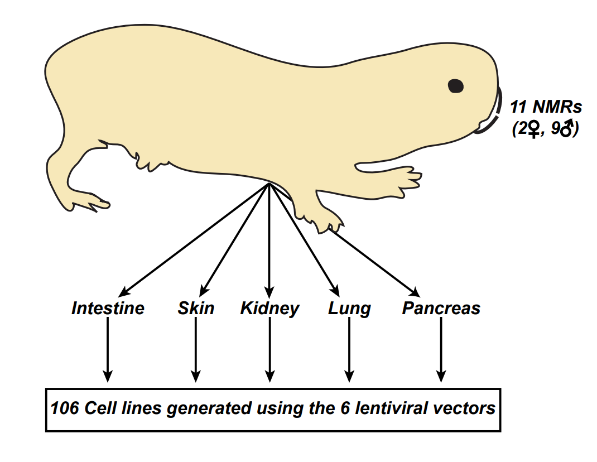

# Transformation of naked mole-rat cells

## About
This repository contains the code for the analysis of RNA-Seq data from Hadi et. al (add citation).
The data required to reproduce the analysis can be found at **add link**

## Abstract
The naked mole-rat (NMR), Heterocephalus glaber, is a mouse-sized subterranean rodent native to East Africa. Research on NMRs is intensifying in an effort to gain leverage from their unusual physiology, long-life span and cancer resistance for the development of new theraputics. Few studies have attempted to explain the reasons behind the NMR’s cancer resistance, but most prominently Tian et al. reported that NMR cells produce high-molecular weight hyaluronan as a potential cause for the NMR’s cancer resistance. Tian et al. have shown that NMR cells are resistant to transformation by SV40 Large T Antigen (SV40LT) and oncogenic HRAS (HRASG12V), a combination of oncogenes sufficient to transform mouse and rat fibroblasts. We have developed a number of lentiviral vectors to deliver both these oncogenes and generated 106 different cell lines from five different tissues and eleven different NMRs, and report here that contrary to Tian et al.’s observation, NMR cells are susceptible to oncogenic transformation by SV40LT and HRASG12V. Our data thus point to a non-cell autonomous mechanism underlying the remarkable cancer resistance of NMRs. Identifying these non-cell autonomous mechanisms could have significant implications on our understanding of human cancer development.

## Repository
- All scripts are contained in the [src](src/) folder
- The meta data is contained in the [data/meta](data/meta) folder

## Links
- Data can also be accessed at ArrayExpress ([E-MTAB-8932](missing)
- [WTK Lab](www.wtklab.com)
